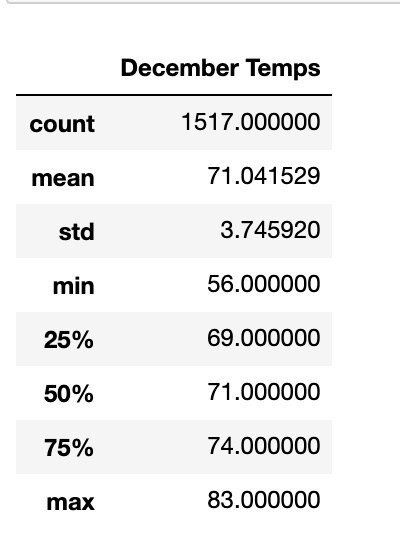
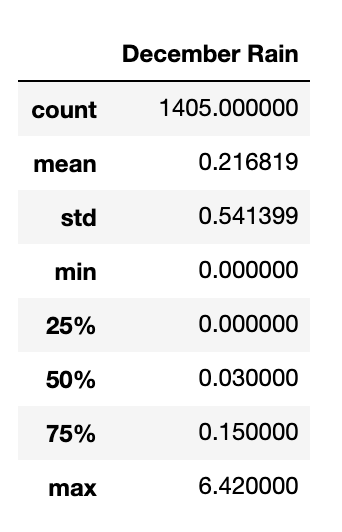

# Surfs-up
This analysis dives into the weather patterns in Oahu, Hawaii to undestand if opening a surf & ice cream shop would be a successful venture. 

Overview of the statistical analysis:

This statistic analysis uses SQLalchemy within python to access weather data stored in a SQLite database. The Measurement class witin this database contains both precipitation and temperature data collected over the span of many years. This data provides great insight at the weather patterns at different points of the year, to understand if this business idea will or will not be impacted by the weater. 

Results:

  

Through a series of querying, creating lists & creating dataframes, I was able to find the statistics summary for any recorded temperature in June & December for every year of data we have data. Observations from data in June & December include: 
* The average of temperatures during this month are similar. June has higher temperatures on average by about 4 degrees
* The maximum temperatures for those months are also very similar, differing by about 2 degrees. The maximum temperature for December was 83 degrees F. The maximum temperature for June was 85 degrees F. 
* There was a larger difference between the minimum temperatures for both months. December saw lower temperatures, with the lowest temperature recorded being 56 degrees F. The lowest temperature recorded for June was 64 degrees F. 

Summary:

  

Using the same approach for finding the statistic summary for temperature in December & June, I was able to find information around rainfall in both of those months. Some key insights include: 
* Both months had a minimum of 0 inches of rain recorded 
* Both months had an average rainfall of less than half an inch. December had an average rainfall of of .22 inches, while June had an average of .14 inches
* The maximum rainfall for both months were significantly higher than the averages. June had a maximum rainfall recorded of 4.43 inches, while December had a max record of 6.42 inches. However, this seemed like it was a more rare occurance for either month. 75% of December's recorded data fall under .15 inches of rain. 75% of June's recorded data falls under .12 inches. 

Based on both temperature and rainfall for both December & June Oahu seems like an ideal place to have an ice cream & surf shop. On average the weather in both months stayed in the 70s. Even though there were occasionally days with high levels of rain in both months, that appears to be more of an occasional occurance rather than a common one. 
